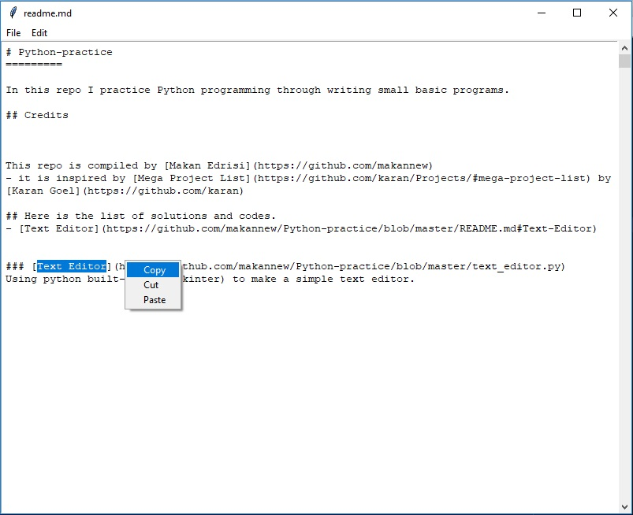

# Python-practice
=========

In this repo I practice Python programming through writing small basic programs.

## Credits

This repo is compiled by [Makan Edrisi](https://github.com/makannew)
- it is inspired by [Mega Project List](https://github.com/karan/Projects/#mega-project-list) by [Karan Goel](https://github.com/karan)

## Here is the list of solutions and codes.
- [Text Editor](https://github.com/makannew/Python-practice/blob/master/README.md#Text-Editor)

### [Text Editor](https://github.com/makannew/Python-practice/blob/master/text_editor.py)
Using python built-in GUI (tkinter) to make a simple text editor.

